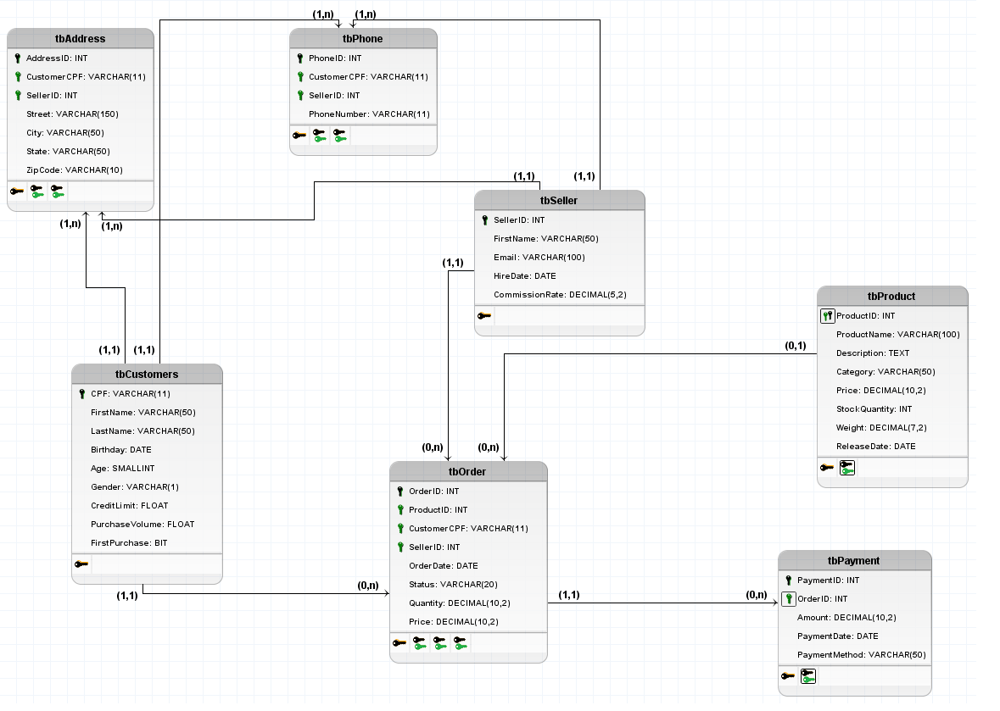

# Projeto_EcommerceDB

Bem-vindo ao repositório do Projeto_EcommerceDB! Este projeto é um banco de dados para um sistema de e-commerce, projetado para armazenar informações sobre clientes, produtos, pedidos, pagamentos e outros elementos relevantes.

## Conteúdo

1. [Visão Geral](#visão-geral)
2. [Estrutura do Banco de Dados](#estrutura-do-banco-de-dados)
3. [Licença](#licença)

## Visão Geral

Este projeto tem como objetivo fornecer uma base sólida para o desenvolvimento de sistemas de e-commerce, com um foco especial na gestão de dados relacionados a clientes, produtos, pedidos e pagamentos.

## Estrutura do Banco de Dados

O banco de dados é composto pelas seguintes tabelas principais:

- `tbAddress`: Armazena informações sobre endereços.
- `tbPhone`: Registra números de telefone associados a clientes e vendedores.
- `tbCustomers` e `tbSeller`: Contêm informações específicas sobre clientes e vendedores, respectivamente.
- `tbProduct`: Mantém detalhes sobre os produtos disponíveis.
- `tbOrder`: Registra informações sobre pedidos feitos pelos clientes.
- `tbPayment`: Armazena dados relacionados aos pagamentos realizados.

## Modelo Lógico do Banco de Dados

_Descrição da Imagem: Modelo lógico representando a estrutura do banco de dados do projeto._

## Licença

Este projeto está licenciado sob a [MIT]. Consulte o arquivo [LICENSE](LICENSE) para obter mais detalhes.
